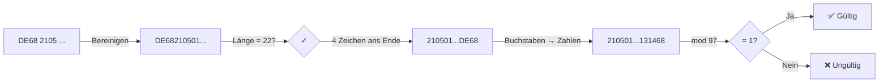
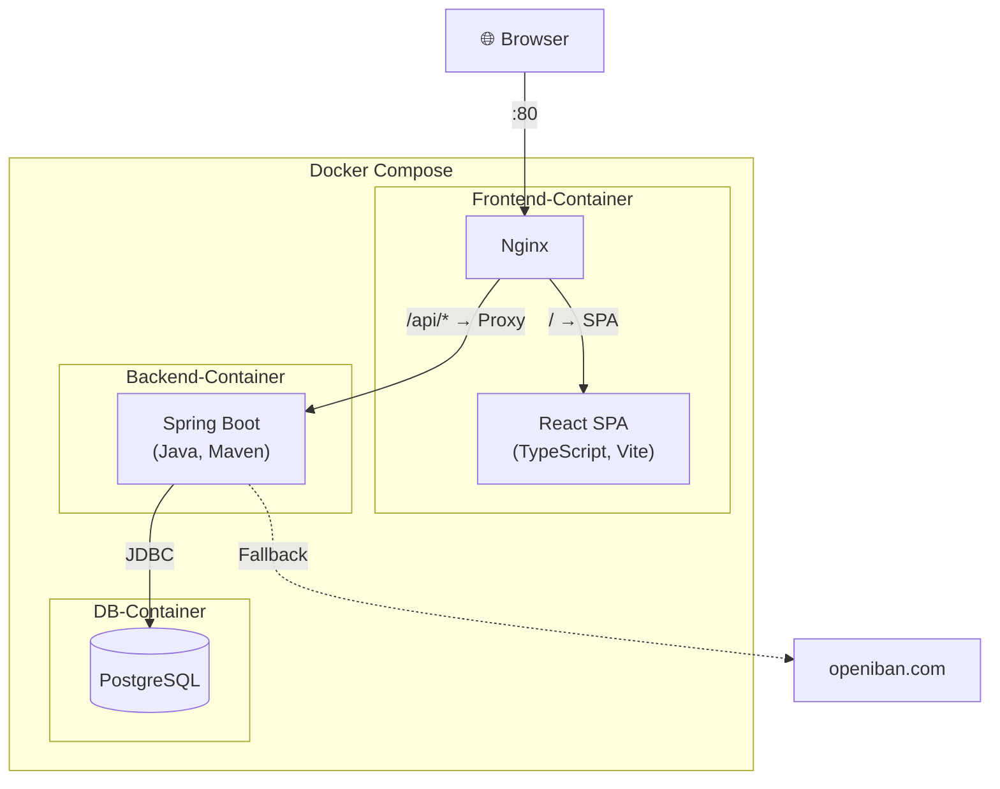
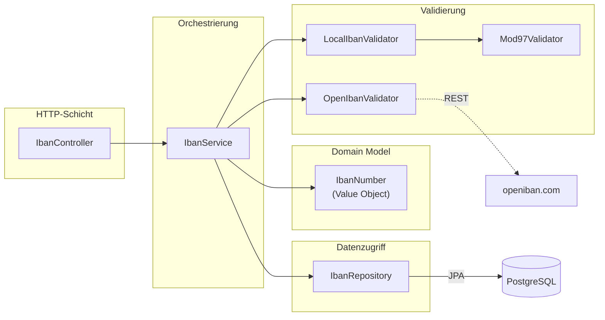
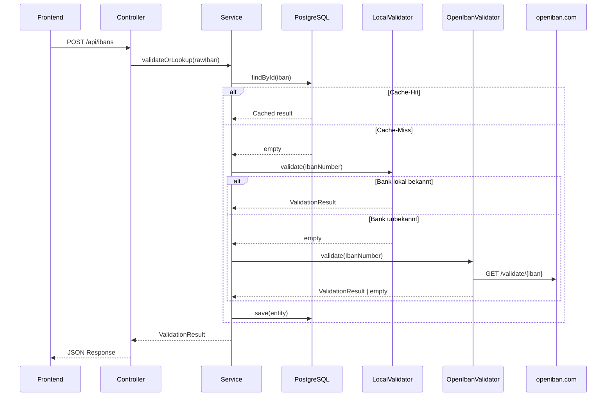
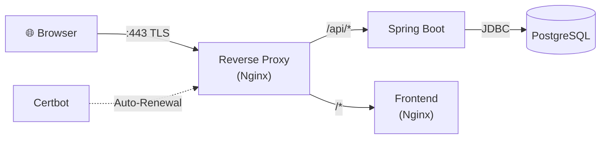
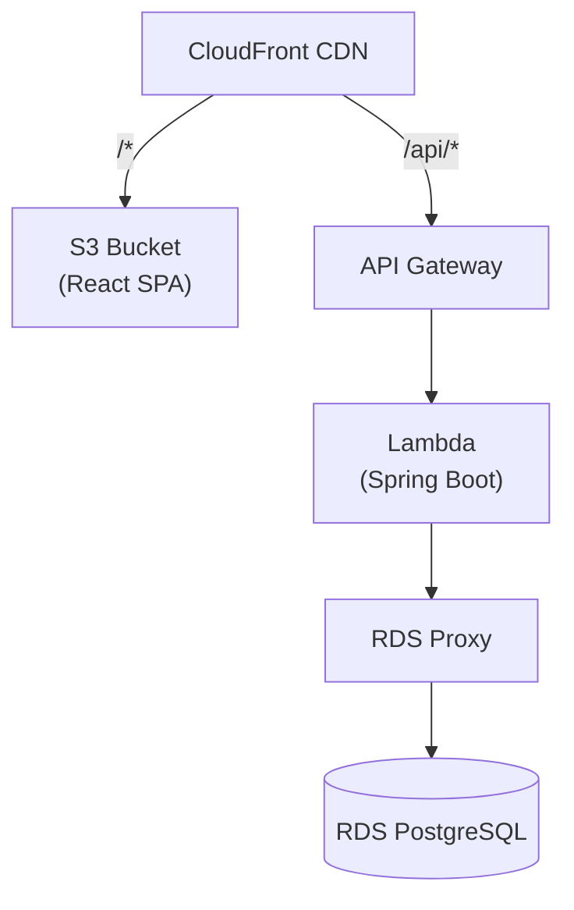

# Lexiban — Präsentations-Skript

> Skript für die Vorstellung der Coding-Challenge im Bewerbungsgespräch.
> Zielgruppe: Technische Interviewer, SCRUM-Team. Dauer: ca. 10–15 Minuten.

---

## 1. Aufgabe & Anforderungen

**Aufgabenstellung:** Eine SPA mit Frontend und Backend erstellen und betreiben, die eine IBAN-Eingabe validiert.

**Vorgegebener Stack:** Java/Spring Boot (Backend), React-SPA (Frontend), REST-Kommunikation, Cloud-Betrieb.

**Umgesetzte Anforderungen:**

1. **Freie IBAN-Eingabe** — Leerzeichen und Trennzeichen erlaubt, automatische 4er-Gruppierung
2. **Eigene Modulo-97-Validierung** — keine Library, eigene Implementierung nach ISO 13616
3. **Banknamen-Auflösung** — drei vordefinierte Banken + Fallback auf externe API (openiban.com)
4. **Persistenz** — validierte IBANs in PostgreSQL mit Cache-Lookup bei wiederholter Anfrage
5. **IBAN-Liste** — gespeicherte IBANs im Frontend anzeigen

---

## 2. Fachlichkeit: Was ist eine IBAN?

Eine **internationale Kontonummer** (max. 34 Zeichen), die Bankverbindungen weltweit eindeutig identifiziert.

**Aufbau einer deutschen IBAN (22 Stellen):**

```
D E 6 8 2 1 0 5 0 1 7 0 0 0 1 2 3 4 5 6 7 8
├─┤ ├─┤ ├───────────────┤ ├─────────────────────┤
 │   │    BLZ (8 Stellen)   Kontonummer (10 Stellen)
 │   Prüfziffern
 Ländercode
```

### Validierung: Modulo-97-Algorithmus (ISO 13616)



Erkennt **100 %** aller einzelnen Tippfehler und Zahlendreher — mathematisch beweisbar. Im Code via `BigInteger`, weil die Zahl 30+ Stellen haben kann.

---

## 3. Architektur & Entscheidungen



### Bewusste Entscheidungen

| Entscheidung                        | Begründung                                                          |
| ----------------------------------- | ------------------------------------------------------------------- |
| **PostgreSQL statt H2**             | Produktionsnah — Flyway-Migrations, Env-Variablen für Credentials   |
| **Flyway statt Hibernate ddl-auto** | Schema-Hoheit liegt in SQL, Hibernate validiert nur                 |
| **Java Records für DTOs**           | Immutable, kein Lombok — plain Java                                 |
| **Constructor Injection**           | Explizite Abhängigkeiten, testbar ohne Spring-Kontext               |
| **Nginx als Reverse Proxy**         | SPA ausliefern + `/api`-Proxy in einem Container                    |
| **IBAN als natürlicher PK**         | Jede IBAN existiert genau einmal — wiederholte Anfragen = Cache-Hit |

---

## 4. Live-Demo

### Happy Path

1. IBAN eingeben → automatische 4er-Formatierung
2. **"Prüfen"** → Ergebnis: gültig, Bankname und BLZ
3. IBAN erscheint in der gespeicherten Liste
4. **Gleiche IBAN erneut** → Cache-Hit, sofortige Antwort

### Edge Cases

- **Ungültige IBAN** → Fehlermeldung
- **Leere Eingabe** → HTTP 400
- **Unbekannte Bank** → Fallback auf openiban.com
- **Wiederholte Anfrage** → kein erneuter Validierungslauf

---

## 5. Backend-Design

### Schichtenarchitektur



### Design-Prinzipien

**Dünner Controller** — kein Business-Logik, nur HTTP ↔ Service Mapping. Validierung via `@Valid`.

**Value Object `IbanNumber` (DDD)** — Self-normalizing Record: entfernt Sonderzeichen, Uppercase, strukturelle Validierung. Wer ein `IbanNumber` hat, weiß dass es normalisiert ist.

**Strategy Pattern für Validierung** — Ein `IbanValidator`-Interface, zwei Implementierungen:

- `LocalIbanValidator` — Länderlänge + Mod-97 + BLZ-Lookup
- `OpenIbanValidator` — REST-Call an openiban.com

Beide geben `Optional<ValidationResult>` zurück — `empty()` heißt "nächster Validator ist dran".

**Graceful Degradation** — externer API-Call komplett in `try/catch`. Die App funktioniert immer, schlimmstenfalls ohne Banknamen.

**Zentrales Error Handling** — `@RestControllerAdvice` mit konsistenten Error-Responses für Validierungsfehler (400) und unerwartete Fehler (500).

### Request-Ablauf



---

## 6. Testing-Strategie

**Backend (JUnit):** Unit-Tests für jede Schicht — Service-Orchestrierung, Validatoren, Mod-97-Algorithmus, Value Object — plus Integrationstests für den Controller (`@WebMvcTest`).

**Frontend (Vitest + Testing Library):** Utility-Funktionen, Komponenten-Rendering, Custom Hooks.

Jede Klasse isoliert testbar durch Constructor Injection und Interface-basierte Abhängigkeiten.

```bash
make check   # Backend: Spotless + Checkstyle + Tests | Frontend: ESLint + Tests
```

---

## 7. Deployment — Drei Wege

### Lokale Entwicklung

```bash
make db be fe   # PostgreSQL + Spring Boot + Vite Dev-Server
```

Vite proxied `/api/*` ans Backend. `.env` für DB-Credentials.

### Docker Compose — VPS mit HTTPS



Netzwerk-Isolation, Healthcheck-basiertes `depends_on`, Let's Encrypt via Certbot.

### AWS Cloud-Native (CDK + GitHub Actions)



**Derselbe Spring-Boot-Code, anderes Packaging:** Fat JAR (Docker/Tomcat) vs. Shaded JAR (Lambda). Ein `StreamLambdaHandler` bridged API-Gateway-Events in Springs `DispatcherServlet` — kein Tomcat-Server nötig.

**Infrastruktur als Code:** 4 CDK-Stacks (TypeScript). CI/CD via GitHub Actions mit OIDC — keine statischen Credentials.

**Frontend: Null Änderungen.** Relative Pfade, CloudFront routet `/api/*` an API Gateway.

### Vergleich

| Aspekt     | Lokal (Makefile)  | Docker Compose (VPS)   | AWS CDK (Serverless)  |
| ---------- | ----------------- | ---------------------- | --------------------- |
| Zielgruppe | Entwicklung       | Self-hosted Production | Cloud Production      |
| Start      | `make db be fe`   | `make prod-up`         | `cdk deploy --all`    |
| HTTPS      | Nein              | Let's Encrypt          | CloudFront            |
| Skalierung | Einzelner Rechner | Vertikale Skalierung   | Auto-Scaling (Lambda) |

---
