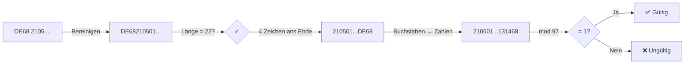
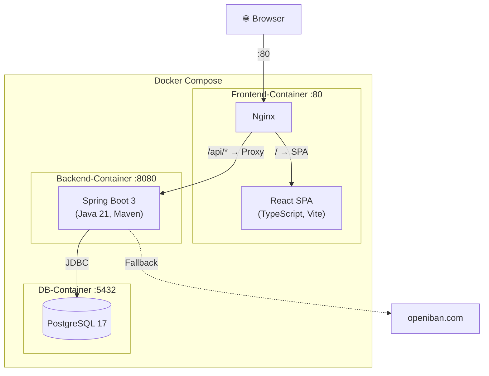
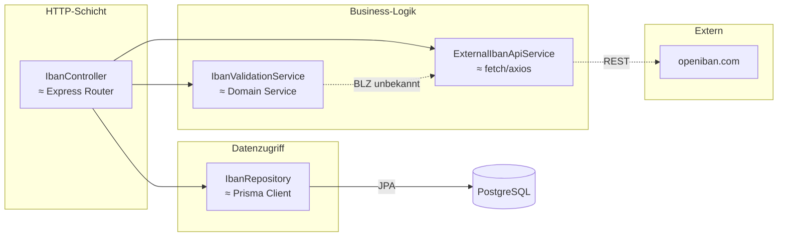
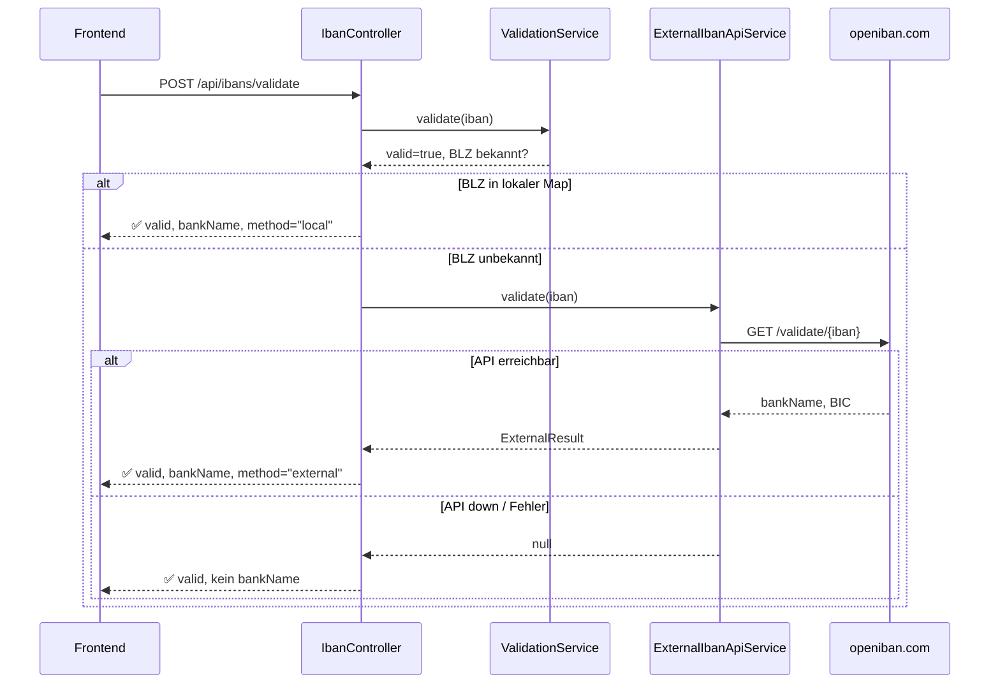
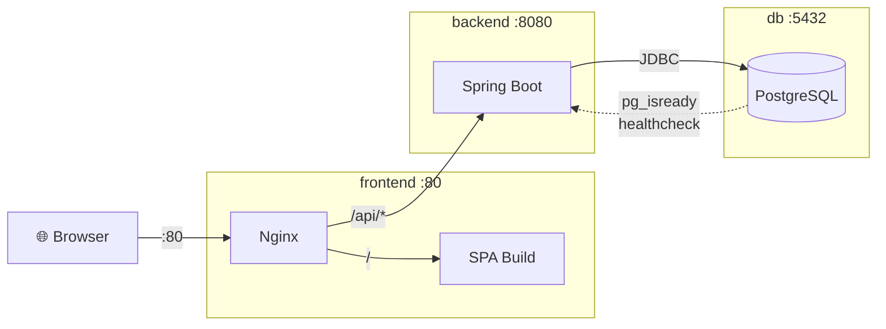

# IBAN Validator — Präsentations-Skript

> Skript für die Vorstellung der Coding-Challenge im Bewerbungsgespräch.
> Zielgruppe: Technische Interviewer. Dauer: ca. 10–15 Minuten.

---

## 1. Einstieg & Kontext

**Wer bin ich:** Nico Gräf — Senior Fullstack-Entwickler mit 10+ Jahren Erfahrung, primär TypeScript/React/Node.js/Go. Java kenne ich aus dem Studium (Android-Apps, Desktop-Projekte), aber Spring Boot und Enterprise-Java sind neu für mich — genau das hat mich an dieser Challenge gereizt.

**Was ist das Projekt:** Eine Single-Page-App zur IBAN-Validierung und -Speicherung. React-Frontend, Spring-Boot-Backend, PostgreSQL-Datenbank — alles containerisiert mit Docker Compose.

**Was will ich zeigen:** Dass ich mich schnell in unbekannte Technologien einarbeiten kann, sauberen Code schreibe und architektonische Entscheidungen reflektiert treffe.

---

## 2. Fachlichkeit: Was ist eine IBAN?

_(Kurzer fachlicher Überblick, damit die Interviewer den Kontext haben — Detailalgorithmus folgt in Abschnitt 7.)_

Eine **internationale Kontonummer** (max. 34 Zeichen, alphanumerisch), die Bankverbindungen weltweit eindeutig identifiziert. Seit 2014 Pflicht in der EU (SEPA). 89 Länder nutzen das System.

**Aufbau — immer gleich:**

```
[Ländercode 2 Buchstaben][Prüfziffern 2 Ziffern][BBAN länderspezifisch]
```

### Deutsche IBAN — das relevanteste Format im Projekt

Immer **exakt 22 Stellen**:

```
D E 6 8 2 1 0 5 0 1 7 0 0 0 1 2 3 4 5 6 7 8
├─┤ ├─┤ ├───────────────┤ ├─────────────────────┤
 │   │    BLZ (8 Stellen)   Kontonummer (10 Stellen)
 │   Prüfziffern (68)
 Ländercode ("DE")
```

- **BLZ** (Bankleitzahl, Pos. 5–12): identifiziert die Bank. Im Code ein simpler Substring.
- **Kontonummer** (Pos. 13–22): mit führenden Nullen auf 10 Stellen aufgefüllt.

### Validierungsprinzip (Modulo 97)



| Schritt | Was passiert                                | Beispiel                        |
| ------- | ------------------------------------------- | ------------------------------- |
| 1       | Länge prüfen (DE = 22)                      | `DE68210501700012345678` → 22 ✓ |
| 2       | Erste 4 Zeichen ans **Ende** schieben       | `210501700012345678DE68`        |
| 3       | Buchstaben → Zahlen (`A=10, B=11, …, Z=35`) | `210501700012345678131468`      |
| 4       | Diese riesige Zahl **mod 97** rechnen       | `= 1` → gültig ✓                |

`BigInteger` in Java nötig, weil die Zahl 60+ Stellen haben kann (≈ JavaScript `BigInt`).

### Fehlererkennungsfähigkeit

- **100 %** aller einzelnen Tippfehler erkannt
- **100 %** aller Zahlendreher zweier benachbarter Ziffern erkannt
- Auslassung/Verdopplung durch feste Länge erkannt

→ Mathematisch beweisbar, dass Modulo 97 ausreicht.

### Schreibweise — Frontend-relevant

| Kontext                    | Format                      | Beispiel                      |
| -------------------------- | --------------------------- | ----------------------------- |
| **Elektronisch** (API, DB) | Ohne Trennzeichen           | `DE68210501700012345678`      |
| **Anzeige** (DIN 5008)     | 4er-Gruppen mit Leerzeichen | `DE68 2105 0170 0012 3456 78` |

Das Frontend entfernt Leerzeichen, Bindestriche und Punkte **vor** dem API-Aufruf. Die Anzeige erfolgt in 4er-Gruppen.

---

## 3. Anforderungen

Sechs Kern-Features, die alle umgesetzt sind:

1. **Freie IBAN-Eingabe** — Leerzeichen und Trennzeichen erlaubt, automatische 4er-Gruppierung
2. **Eigene Modulo-97-Validierung** — keine Library, eigene Implementierung nach ISO 13616
3. **Externe API als Fallback** — openiban.com für Bankauflösung, wenn die lokale Logik keine Bank kennt
4. **Banknamen-Auflösung** — drei vordefinierte Banken (Deutsche Bank, Commerzbank, Berliner Sparkasse)
5. **Persistenz** — validierte IBANs in PostgreSQL speichern
6. **IBAN-Liste** — gespeicherte IBANs im Frontend anzeigen

---

## 4. Architektur & Tech-Stack



| Schicht    | Technologie                   | Warum diese Wahl?                                       |
| ---------- | ----------------------------- | ------------------------------------------------------- |
| Frontend   | React 18, TypeScript, Vite    | Mein Haupttool — TypeScript strict, shadcn/ui, Tailwind |
| Backend    | Java 21, Spring Boot 3, Maven | Anforderung der Challenge — frisch erlernt              |
| Datenbank  | PostgreSQL 17                 | Produktionsnah, Flyway-Migrations, nicht H2 (bewusst)   |
| Deployment | Docker Compose (3 Services)   | Alles mit einem Befehl startbar                         |
| Proxy      | Nginx (im Frontend-Container) | Dient SPA-Dateien aus + proxied `/api` zum Backend      |

**Bewusste Entscheidung: PostgreSQL statt H2.** H2 wäre einfacher gewesen (kein Docker-Container nötig), aber PostgreSQL zeigt realistische Produktions-Patterns: Flyway-Migrations, Environment-Variablen für Credentials, healthcheck-basiertes `depends_on`.

---

## 5. Live-Demo

### Happy Path

1. App öffnen → IBAN-Eingabefeld sichtbar
2. `DE89 3704 0044 0532 0130 00` eingeben → automatische Formatierung
3. **"Validieren"** klicken → Ergebnis: gültig, Commerzbank, BLZ 37040044, Methode "local"
4. **"Validieren & Speichern"** klicken → IBAN wird gespeichert, erscheint in der Liste unten

### Edge Cases zeigen

- **Ungültige IBAN** (`DE00...`) → "ungültig", rotes Ergebnis
- **Leere Eingabe** → HTTP 400 durch `@NotBlank`-Validation, Fehlermeldung im Frontend
- **Unbekannte Bank** → Fallback auf openiban.com, `validationMethod: "external"`
- **Leerzeichen/Bindestriche** → werden automatisch entfernt, Validierung funktioniert weiterhin

---

## 6. Backend-Architektur (Code-Walkthrough)

### Die drei Schichten



### Controller (IbanController.java)

- `@RestController` mit drei Endpunkten: `POST /validate`, `POST /`, `GET /`
- DTOs als **Java Records** (≈ TypeScript `type`) — `IbanRequest`, `IbanResponse`, `IbanListEntry`
- `@Valid` + `@NotBlank` übernehmen die Input-Validation (≈ zod)
- Die Fallback-Logik ist in eine private `buildResponse()`-Methode extrahiert (DRY)
- **Constructor Injection** — kein `@Autowired` auf Feldern, weil: `final`-Felder, explizite Dependencies, testbar ohne Spring

### Service (IbanValidationService.java)

- Eigene Modulo-97-Implementierung (gleich im Detail)
- BLZ-Lookup via `Map.of()` für drei bekannte Banken
- Reiner Service ohne Frameworks — direkt mit `new` instanziierbar, ideal für Unit-Tests

### Repository (IbanRepository.java)

- **Eine einzige Zeile**: `extends JpaRepository<Iban, Long>`
- Spring generiert zur Laufzeit die komplette CRUD-Implementierung
- ≈ Prisma Client, der automatisch `findAll()`, `save()`, `deleteById()` bereitstellt

---

## 7. Modulo-97 — Die Validierungslogik

Der Algorithmus nach ISO 13616 (Folie oder Code zeigen):

```
Eingabe:    DE89 3704 0044 0532 0130 00
Schritt 1:  Bereinigen → DE89370400440532013000
Schritt 2:  Länge prüfen → 22 Zeichen ✓ (DE = 22)
Schritt 3:  Erste 4 Zeichen ans Ende → 370400440532013000DE89
Schritt 4:  Buchstaben → Zahlen (D=13, E=14) → 37040044053201300013 1489
Schritt 5:  mod 97 → Ergebnis = 1 → gültig ✓
```

**Im Code:** `BigInteger` (≈ JavaScript `BigInt`) für die Division, weil die Zahl 30+ Stellen hat und in keinen nativen Integer passt.

**BLZ-Extraktion:** Bei deutschen IBANs sind Stellen 5–12 die Bankleitzahl. Aus `DE89370400440532013000` wird BLZ `37040044` → Lookup: "Commerzbank".

---

## 8. Externe API — Graceful Degradation

Wenn die lokale BLZ-Tabelle die Bank nicht kennt, fragt `ExternalIbanApiService` die openiban.com-API:



```
GET https://openiban.com/validate/{iban}?getBIC=true&validateBankCode=true
```

- **RestClient** (Spring 6.1) als HTTP-Client (≈ fetch/axios)
- Ganzer Call in `try/catch` — wenn openiban.com down ist, wird `null` zurückgegeben
- **Graceful Degradation**: Die App funktioniert immer, nur ohne Banknamen-Auflösung
- Im Response steht dann `validationMethod: "external"` statt `"local"`

---

## 9. Error Handling

Zentraler `GlobalExceptionHandler` mit `@RestControllerAdvice` — ≈ Express Error-Handling Middleware:

- `@NotBlank`-Validation schlägt fehl → HTTP 400 mit strukturierter Fehlermeldung
- Unbehandelte Exceptions → HTTP 500 mit generischer Meldung (kein Stack-Trace zum Client)
- Jede Response ist konsistentes JSON — keine HTML-Error-Pages

---

## 10. Datenbankschicht

### Entity (Iban.java)

7 Felder: `id` (auto-generiert), `iban`, `bankName`, `bankIdentifier`, `valid`, `validationMethod`, `createdAt`.

**Warum kein Record?** JPA/Hibernate braucht Mutabilität + leeren Konstruktor (Reflection), Records sind immutable. DTOs sind Records, Entities sind Klassen.

### Flyway Migration

- Eine SQL-Datei: `V1__initial_schema.sql` — erstellt die `ibans`-Tabelle
- **Schema-Quelle:** SQL-Datei (nicht Hibernate). `ddl-auto=validate` prüft nur, ändert nie die DB
- ≈ Prisma Migrate — versionierte, reproduzierbare Schema-Änderungen

---

## 11. Testing

**16 Backend-Tests** (JUnit 5), alle grün:

| Art             | Datei                       | Tests | Was wird getestet?                                                                                   |
| --------------- | --------------------------- | ----- | ---------------------------------------------------------------------------------------------------- |
| **Unit**        | `IbanValidationServiceTest` | 12    | Mod-97-Algorithmus, BLZ-Lookup, Edge Cases (Leerzeichen, Bindestriche, Lowercase, ungültige Zeichen) |
| **Integration** | `IbanControllerTest`        | 4     | HTTP-Routing, JSON-Serialisierung, Validation (`@NotBlank` → 400), Mocking via `@MockitoBean`        |

**3 Frontend-Tests** (Vitest + React Testing Library):

- Smoke-Tests: Render der Eingabe, Validate-Button, Save-Button

**Testen lässt sich so:**

```bash
cd backend && mvn verify -B       # Backend: 16 Tests
cd frontend && pnpm test           # Frontend: 3 Tests
```

---

## 12. Docker Compose

Drei Services, ein Befehl: `docker compose up --build`



- **Kein separater Reverse-Proxy-Container** — Nginx im Frontend-Container übernimmt beides
- **Healthcheck:** Postgres meldet sich via `pg_isready`, Backend wartet mit `depends_on: condition: service_healthy`
- **Secrets:** `.env`-Datei für DB-Credentials, nicht hardcoded

---

## 13. Was ich gelernt habe

| Spring Boot / Java                      | Mein Vergleich (TS/Node/Go)                 |
| --------------------------------------- | ------------------------------------------- |
| `@RestController` + `@RequestMapping`   | Express Router                              |
| Constructor Injection (IoC)             | Manuelles Wiring in Go / Angulars DI        |
| `@Service`, `@Repository` — Schichten   | Domain-Layer-Pattern, das ich aus DDD kenne |
| `JpaRepository` (0 Zeilen eigener Code) | Prisma Client                               |
| Flyway Migrations                       | Prisma Migrate / golang-migrate             |
| `@Valid` + `@NotBlank`                  | zod-Validation                              |
| `@RestControllerAdvice`                 | Express Error-Handling Middleware           |
| `BigInteger` für Mod 97                 | JavaScript `BigInt`                         |
| Maven `pom.xml` + Starter Dependencies  | `package.json` + npm-Scripts                |
| `@WebMvcTest` + `MockMvc`               | Vitest + Supertest                          |

**Mein Key Takeaway:** Spring Boot ist überraschend produktiv, sobald man die Annotation-Magie versteht. Die Convention-over-Configuration-Philosophie erinnert mich an Angular (DI, Decoratoren, strikte Struktur). Die Projektstruktur Controller → Service → Repository ist letztlich das gleiche Layered-Architecture-Pattern, das ich aus Node.js/Go-Projekten kenne.

---

## 14. Was ich als nächstes bauen würde

_(Zeigt Weitblick, auch wenn es nicht Scope der Challenge ist)_

- **HTTPS** mit Let's Encrypt + Certbot
- **CI/CD** mit GitHub Actions (Tests + Docker-Build)
- **Dark Mode** (CSS-Variablen sind vorbereitet)
- **Authentifizierung** (JWT + Spring Security)
- **CSV-Export** der gespeicherten IBANs

→ Detailliert dokumentiert in [future.md](future.md)

---

## 15. Abschluss

- **Projekt:** IBAN Validator — React + Spring Boot + PostgreSQL + Docker
- **Eigene Modulo-97-Implementierung** nach ISO 13616
- **16 Backend-Tests + 3 Frontend-Tests**, alle grün
- **Produktionsnahe Architektur** mit Flyway, Docker Compose, Nginx-Proxy
- **Saubere Doku:** README, Architecture Decisions, Fachliches Wissen, Lernguide
- **Reflection:** Alle Entscheidungen in decisions.md begründet — auch was man in Produktion anders machen würde

> **Fragen?**
