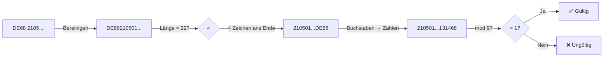
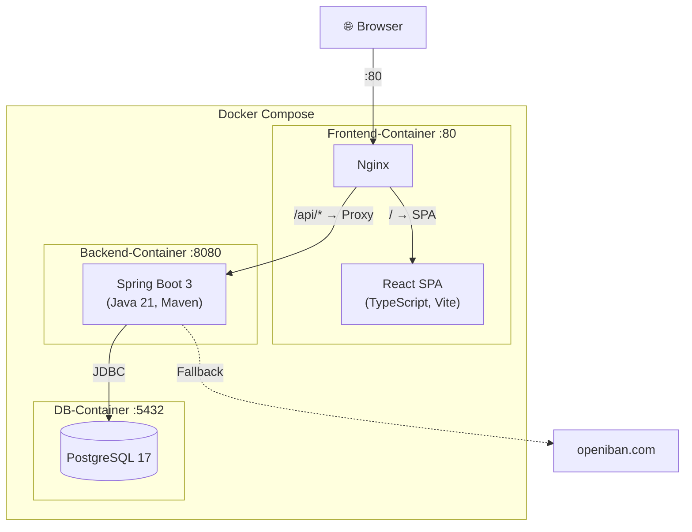
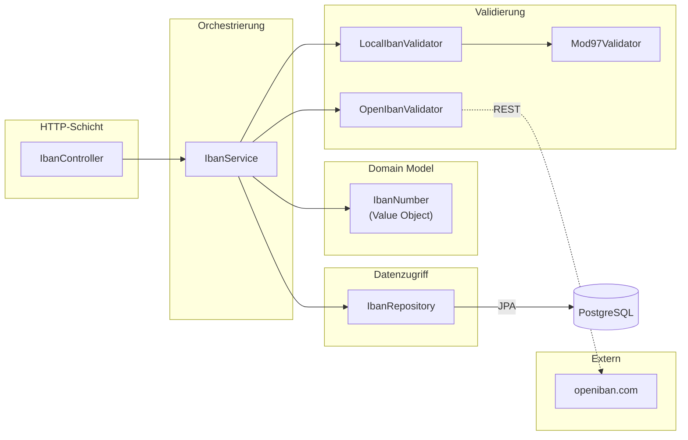
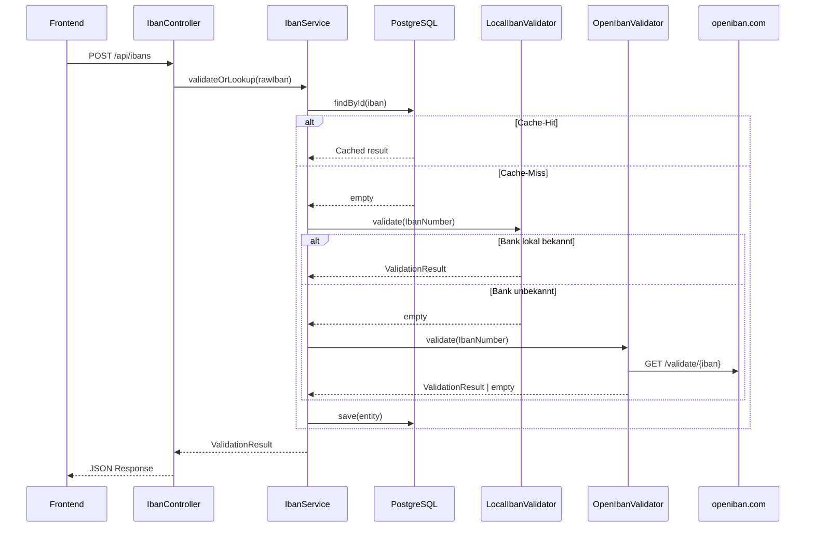
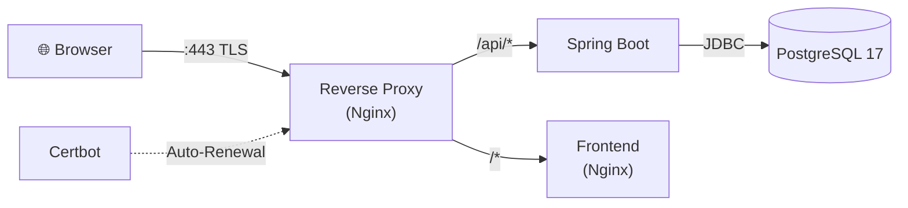
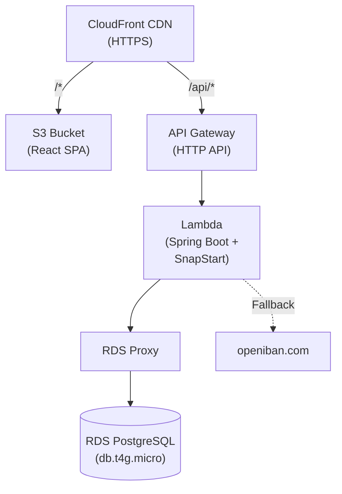

# Lexiban — Präsentations-Skript

> Skript für die Vorstellung der Coding-Challenge im Bewerbungsgespräch.
> Zielgruppe: Technische Interviewer, SCRUM-Team. Dauer: ca. 10–15 Minuten.

---

## 1. Aufgabe

**Aufgabenstellung:** Eine Single-Page-App mit Frontend und Backend erstellen und betreiben, die eine IBAN-Eingabe validiert. Dazu eine kurze Präsentation als fachliche Diskussionsgrundlage vorbereiten.

**Anforderungen:**

1. Freie Benutzereingaben erlauben — inklusive Trennzeichen zwischen den Ziffern
2. Im Backend keine Trennzeichen enthalten — Bereinigung vor der Verarbeitung
3. Im Backend prüfen, ob die IBAN valide ist
4. Für drei bekannte Banken nach Eingabe der IBAN den Banknamen anzeigen
5. Speicherung der IBAN in einer Datenbank
6. Einen anderen Weg finden — z. B. Anbindung einer externen API zur Validierung oder Namensauflösung

**Vorgegebener Stack:**

| Schicht       | Vorgabe                                                 |
| ------------- | ------------------------------------------------------- |
| Backend       | Java mit REST-API (Spring Boot basiert)                 |
| Frontend      | SPA (React basierte WebApp)                             |
| Kommunikation | SPA-Frontend mit REST-Backend-Kommunikation             |
| Betrieb       | Cloud-Betrieb bei beliebigem Anbieter und Infrastruktur |

---

## 2. Fachlichkeit: Was ist eine IBAN?

Eine **internationale Kontonummer** (max. 34 Zeichen, alphanumerisch), die Bankverbindungen weltweit eindeutig identifiziert. Seit 2014 Pflicht in der EU (SEPA).

**Aufbau:**

```
[Ländercode 2 Buchstaben][Prüfziffern 2 Ziffern][BBAN länderspezifisch]
```

### Deutsche IBAN — exakt 22 Stellen

```
D E 6 8 2 1 0 5 0 1 7 0 0 0 1 2 3 4 5 6 7 8
├─┤ ├─┤ ├───────────────┤ ├─────────────────────┤
 │   │    BLZ (8 Stellen)   Kontonummer (10 Stellen)
 │   Prüfziffern (68)
 Ländercode ("DE")
```

- **BLZ** (Bankleitzahl, Pos. 5–12): identifiziert die Bank eindeutig.
- **Kontonummer** (Pos. 13–22): mit führenden Nullen auf 10 Stellen aufgefüllt.

### Validierung: Modulo-97-Algorithmus (ISO 13616)



| Schritt | Was passiert                                | Beispiel                        |
| ------- | ------------------------------------------- | ------------------------------- |
| 1       | Länge prüfen (DE = 22)                      | `DE68210501700012345678` → 22 ✓ |
| 2       | Erste 4 Zeichen ans **Ende** schieben       | `210501700012345678DE68`        |
| 3       | Buchstaben → Zahlen (`A=10, B=11, …, Z=35`) | `210501700012345678131468`      |
| 4       | Diese Zahl **mod 97** rechnen               | `= 1` → gültig ✓                |

Im Code: `BigInteger`, weil die Zahl 30+ Stellen haben kann.

Modulo 97 erkennt **100 %** aller einzelnen Tippfehler und Zahlendreher — mathematisch beweisbar.

---

## 3. Anforderungen

Alle sechs Anforderungen umgesetzt:

1. **Freie IBAN-Eingabe** — Leerzeichen und Trennzeichen erlaubt, automatische 4er-Gruppierung
2. **Eigene Modulo-97-Validierung** — keine Library, eigene Implementierung nach ISO 13616
3. **Externe API als Fallback** — openiban.com für Bankauflösung bei unbekannter BLZ
4. **Banknamen-Auflösung** — drei vordefinierte Banken (Deutsche Bank, Commerzbank, Berliner Sparkasse)
5. **Persistenz** — validierte IBANs in PostgreSQL speichern
6. **IBAN-Liste** — gespeicherte IBANs im Frontend anzeigen

---

## 4. Architektur & Tech-Stack



| Schicht    | Technologie                   | Warum diese Wahl?                                       |
| ---------- | ----------------------------- | ------------------------------------------------------- |
| Frontend   | React 19, TypeScript, Vite    | Mein Haupttool — TypeScript strict, shadcn/ui, Tailwind |
| Backend    | Java 21, Spring Boot 3, Maven | Anforderung der Challenge — frisch erlernt              |
| Datenbank  | PostgreSQL 17                 | Produktionsnah, Flyway-Migrations                       |
| Deployment | Docker Compose (3 Services)   | Alles mit einem Befehl startbar                         |
| Proxy      | Nginx (im Frontend-Container) | Dient SPA-Dateien aus + proxied `/api` zum Backend      |

**Bewusste Entscheidung: PostgreSQL statt H2.** H2 wäre einfacher gewesen, aber PostgreSQL zeigt realistische Produktions-Patterns: Flyway-Migrations, Environment-Variablen für Credentials, healthcheck-basiertes `depends_on`.

---

## 5. Live-Demo

### Happy Path

1. App öffnen → IBAN-Eingabefeld sichtbar
2. Eine gültige deutsche IBAN eingeben → automatische 4er-Formatierung
3. **"Prüfen"** klicken → Ergebnis: gültig, Bankname und BLZ werden angezeigt
4. IBAN wird gespeichert und erscheint in der Liste unten
5. **Gleiche IBAN erneut senden** → Cache-Hit, sofortige Antwort aus der Datenbank

### Edge Cases

- **Ungültige IBAN** → rotes Ergebnis mit Fehlermeldung
- **Leere Eingabe** → HTTP 400 durch `@NotBlank`-Validation
- **Unbekannte Bank** (BLZ nicht in lokaler Map) → Fallback auf openiban.com
- **Leerzeichen/Bindestriche** → werden automatisch entfernt
- **Wiederholte Anfrage** → Cache-Hit, keine erneute Validierung

---

## 6. Backend-Architektur

### Überblick



### Controller — dünn

- `@RestController` mit zwei Endpunkten: `POST /api/ibans`, `GET /api/ibans`
- DTOs als **Java Records** (innere Klassen): `IbanRequest`, `IbanResponse`, `IbanListEntry`
- `@Valid` + `@NotBlank` für Input-Validation
- Kein Business-Logik — nur HTTP ↔ Service Mapping
- Constructor Injection

### Value Object: IbanNumber (DDD)

- Self-normalizing Java Record: entfernt Sonderzeichen, Uppercase, strukturelle Validierung per Regex
- Garantiert: wer ein `IbanNumber` hat, weiß dass es normalisiert ist
- Methoden: `countryCode()`, `bankIdentifier()`, `bban()`, `formatted()`
- Wirft `IbanFormatException` bei ungültigem Format

### Validator-Architektur (Strategy Pattern)

Ein `IbanValidator`-Interface mit zwei Implementierungen:

1. **`LocalIbanValidator`** — Prüft Länderlänge + Mod-97 + BLZ-Lookup für drei bekannte Banken
2. **`OpenIbanValidator`** — Fragt openiban.com per `RestClient`, wenn die lokale Logik keine Bank kennt

Beide geben `Optional<ValidationResult>` zurück — `empty()` heißt "ich kann nicht weiterhelfen, nächster Validator".

### Service (IbanService) — orchestriert

`validateOrLookup(String rawIban)`: Cache-Lookup → LocalIbanValidator → OpenIbanValidator → Fallback → Speichern

### Mod97Validator

Eigenständige `@Service`-Klasse für den ISO-7064-Algorithmus. Isoliert testbar, ohne Spring-Kontext.

### Request-Ablauf



### Externe API — Graceful Degradation

```
GET https://openiban.com/validate/{iban}?getBIC=true&validateBankCode=true
```

- `RestClient` (Spring 6.1) als HTTP-Client
- Gesamter Call in `try/catch` — bei Fehler wird `Optional.empty()` zurückgegeben
- Die App funktioniert immer — schlimmstenfalls ohne Banknamen

### Error Handling

Zentraler `GlobalExceptionHandler` mit `@RestControllerAdvice`:

- `MethodArgumentNotValidException` → HTTP 400 mit strukturierter Fehlermeldung
- `IbanFormatException` → HTTP 400 mit Validierungsdetails
- Unbehandelte Exceptions → HTTP 500 mit generischer Meldung

---

## 7. Datenbankschicht

### Entity (Iban.java)

5 Felder: `iban` (natürlicher Primary Key), `bankName`, `valid`, `reason`, `createdAt`.

**IBAN als Primary Key:** Jede IBAN existiert genau einmal. Wiederholte Anfragen liefern das gespeicherte Ergebnis (Cache-Lookup).

**Warum kein Record?** JPA braucht Mutabilität + leeren Konstruktor. DTOs sind Records, Entities sind Klassen.

### Repository

`IbanRepository extends JpaRepository<Iban, String>` — automatische CRUD-Implementierung plus Custom Query `findAllByOrderByCreatedAtDesc()`.

### Flyway Migration

Eine SQL-Datei: `V1__initial_schema.sql`. Schema-Quelle ist SQL (nicht Hibernate). `ddl-auto=validate` prüft nur, ändert nie die DB.

---

## 8. Testing

**59 Backend-Tests** (JUnit 5), alle grün:

| Art             | Klasse                   | Tests | Was wird getestet?                                           |
| --------------- | ------------------------ | ----- | ------------------------------------------------------------ |
| **Unit**        | `IbanServiceTest`        | 12    | Orchestrierung, Cache-Lookup, Validator-Delegation, Persist  |
| **Unit**        | `LocalIbanValidatorTest` | 12    | Länderlänge, Mod-97, BLZ-Lookup, Edge Cases                  |
| **Unit**        | `OpenIbanValidatorTest`  | 5     | API-Aufruf, Fehlerbehandlung, Graceful Degradation           |
| **Unit**        | `Mod97ValidatorTest`     | 8     | Isolierter Modulo-97-Algorithmus                             |
| **Unit**        | `IbanNumberTest`         | 16    | Normalisierung, countryCode(), bankIdentifier(), formatted() |
| **Integration** | `IbanControllerTest`     | 6     | HTTP-Routing, JSON-Serialisierung, Validation (400)          |

**34 Frontend-Tests** (Vitest + React Testing Library):

| Datei                | Tests | Was wird getestet?                                        |
| -------------------- | ----- | --------------------------------------------------------- |
| `utils.test.ts`      | 19    | formatIban, cleanIban, getExpectedLength, COUNTRY_LENGTHS |
| `IbanInput.test.tsx` | 10    | Rendering, Formatierung, Clear-Button, Eingabe-Events     |
| `useFetch.test.ts`   | 5     | Loading-State, Success, Error, Reload                     |

```bash
cd backend && mvn verify -B       # Backend: 59 Tests
cd frontend && pnpm test           # Frontend: 34 Tests
```

---

## 9. Deployment — Drei Wege

### 9.1 Lokale Entwicklung (Makefile)

```bash
make db   # PostgreSQL-Container starten
make be   # Spring Boot mit dev-Profil
make fe   # Vite Dev-Server (HMR, Port 5173)
```

- Vite proxied `/api/*` an `localhost:8080`
- `.env`-Datei für DB-Credentials
- `make check` → Spotless + Checkstyle + Tests (Backend) + ESLint + Tests (Frontend)

### 9.2 Docker Compose — VPS mit HTTPS

**5 Container:** Frontend (Nginx), Backend (Spring Boot), PostgreSQL, Reverse-Proxy (TLS-Terminierung), Certbot.



- Netzwerk-Isolation: PostgreSQL nur im internen `db-network`
- Healthcheck: `pg_isready` → Backend wartet via `depends_on: condition: service_healthy`

### 9.3 AWS Cloud-Native (CDK + GitHub Actions)

Serverless-Deployment: S3 + CloudFront (Frontend), Lambda + API Gateway (Backend), RDS PostgreSQL (Datenbank).



**4 CDK-Stacks (TypeScript):** NetworkStack, DatabaseStack, BackendStack, FrontendStack.

**Backend-Änderungen für AWS — nur 3 Dateien:**

1. `pom.xml` — Dependency: `aws-serverless-java-container-springboot3`
2. `StreamLambdaHandler.java` — Bridged API-Gateway-Events in Spring Boot
3. `application-aws.properties` — RDS-Proxy-Verbindung, `maximum-pool-size=1`

**Frontend: Null Änderungen.** Relative Pfade (`/api/ibans`), CloudFront routet `/api/*` an API Gateway.

**CI/CD:** GitHub Actions mit OIDC-Auth — keine statischen AWS-Credentials.

### Vergleich

| Aspekt     | Lokal (Makefile)  | Docker Compose (VPS)   | AWS CDK (Serverless)     |
| ---------- | ----------------- | ---------------------- | ------------------------ |
| Zielgruppe | Entwicklung       | Self-hosted Production | Cloud Production         |
| Start      | `make db be fe`   | `make prod-up`         | `cdk deploy --all`       |
| HTTPS      | Nein              | Let's Encrypt          | CloudFront               |
| Skalierung | Einzelner Rechner | Vertikale Skalierung   | Auto-Scaling (Lambda)    |
| Kosten     | Gratis            | ~5 €/Monat             | Pay-per-Request (~1–2 €) |

---
